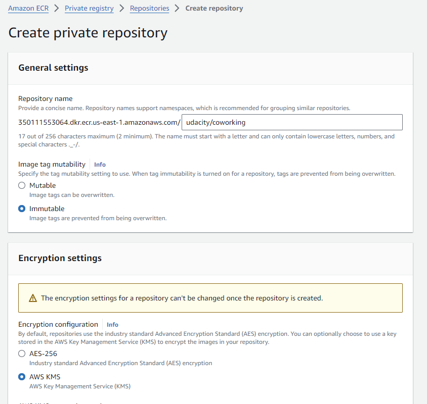

## Getting Started

### Guide Project
1. Folder `analytics` - API to deploy
2. Folder `db` - Data to be used for analytics
3. Folder `deployment` - Resource to use apply to AWS
    a. `pvc.yaml` - Define resource storage data `PersistentVolumeClaim`
    b. `pv.yaml` - Define resource storage data `PersistentVolume`
    c. `db.yaml` - Deployment Database storage data used to `postgresql`
    d. `db-service.yaml` - Deployment Database service
    d. `db-configmap.yaml` - Deployment ConfigMap and Secrets
    d. `deployment.yaml` - Deployment Coworking service
4. Folder `screenshots` - Resources screenshot from application and AWS
    a. `aws-codebuild.png` - Screenshot of AWS CodeBuild pipeline
    b. `get-svc.png` - Screenshot of kubectl get svc
    c. `aws-ecr.png` - Screenshot of AWS ECR repository for the application's repository
    d. `get-pods.png` - Screenshot of kubectl get pods
    e. `get-describe-db-service.png` - Screenshot of kubectl describe svc db-service
    f. `get-describe-deployment.png` - Screenshot of kubectl describe deployment
    g. `aws-cloudwatch.png` - Screenshot of AWS CloudWatch logs for the application

### Dependencies
#### Local Environment
1. Python Environment - run Python 3.6+ applications and install Python dependencies via `pip`
2. Docker CLI - build and run Docker images locally
3. `kubectl` - run commands against a Kubernetes cluster

### Deloyments
1. Run bash: `./init.sh` to create Cluster
2. Open terminal in folder `/deployments` and run bash: `./apply.sh` to apply resource for DB service
3. Test Database Connection:
    a. run command: `kubectl get pods` to get pod name ex: `postgresql-6889d46b98-bd84h`
    b. run command: `kubectl exec -it postgresql-b6c496864-cp5d4 -- bash`
    c. Use username/password for DB defined in `db-configmap.yml`. Then run command to test: `psql -U coworking -d coworking`
4. Open terminal in folder `/deployments` and run command: `kubectl apply -f db-service.yaml` to apply DB service
5. run bash: `./switch_port.sh` to switch port from local port 5433 to node port 5432
6. create and add data to database
    a. open terminal in folder `/db` and run bash: `./upload.sh` to push data to database
    b. run command below to test data:
        - `pgpassword="$db_password" psql --host 127.0.0.1 -u myuser -d mydatabase -p 5433`
7. open terminal in folder `./deployments` and run command `./install_docker.sh` to install docker if you use ubuntu or linux os
    or if you use windows os, you need install docker cli
8. Access to AWS console and create an Amazon ECR repository.

9. Then create an Amazon CodeBuild project and set variable enviroment
    - AWS_DEFAULT_REGION: us-east-1
    - AWS_ACCOUNT_ID: 350111553064
    - IMAGE_REPO_NAME:  udacity/coworking
10. In CodeBuild select project created. then click to `Start build` to build image and run application
11. Copy URI from ECR image build latest and paste to file `/deployments/deployment.yml`
11. Run command: `kubectl apply -f deployment.yml` to apply Cowoking app service
12. Run test api in Coworking app: `./test_api.sh`